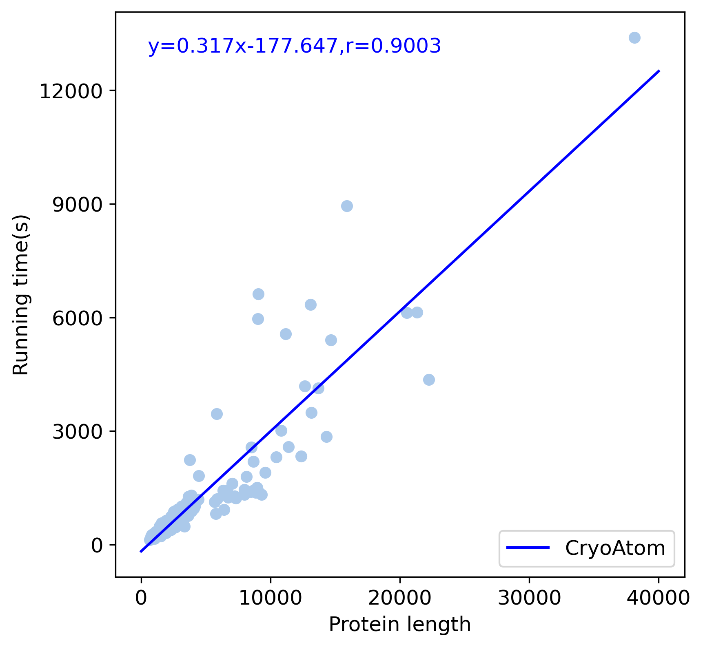

# CryoAtom
<a >
   
   
   
   
</a>

## Overview
CryoAtom is a software that automatically constructs full-atom 3D structural models of proteins based on cryo-EM density maps and sequence information.

It has two main stages: the first step predicts the C<span>&alpha;</span> atom coordinates from the density map, and the second step builds the full-atom model by combining the sequence and density map information. Finally, the full-atom model will undergo a post-processing program to generate the final protein model. This post-processing program is modified from [ModelAngelo](https://github.com/3dem/model-angelo).

<div align=center></div>

For more details on CryoAtom, please refer to the manuscript.

## Hardware requirements
CryoAtom requires at least 3GB of disk space for its own weight files plus the weight files of the ESM language model. 
It also requires at least 13GB of GPU memory.

## Installation

<details>
<summary>Install CryoAtom</summary>
<br>

**Step 1: Install Conda**

It requires to use conda to manage the Python dependencies, which can be installed following https://docs.conda.io/projects/conda/en/latest/user-guide/install/index.html#regular-installation.

**Step 2: Clone this repository**

Now, you need to clone this Github repository with
```
git clone https://github.com/YangLab-SDU/CryoAtom.git
```

**Step 3: Check if the GPU is available**

Ensure that the device you are currently running on has a GPU .it must be able to run the command:
```
nvcc -V
```
If you are in a cluster system, make sure that the node you are on has a GPU (this can be checked using the command 'nvcc -V'). If it does not have one, please first log into any compute node that has a GPU to execute the following commands.

**Step 4: Install CryoAtom**

Navigate to the CryoAtom installation directory and run the installation script:
```
cd CryoAtom
source install.sh
```
Once the installation script has finished running, you will have an CryoAtom execution environment.
Finally, you can run the command
```
cryoatom build -h
```
to check if the installation was successful.
<br>
</details>   
    
## Usage

First, use the command
```
cryoatom build -h
```
to check some basic parameters of CryoAtom. 

Additionally, since the first run requires downloading a 2GB ESM language model weight file, the waiting time is relatively long. 
However, this issue does not occur in subsequent runs.
Below are a few simple examples to illustrate how to use CryoAtom.

<details>
<summary>Use a cryo-EM density map and a FASTA sequence</summary>
<br>

First, we need the density map and the fasta file:
```
wget -P ./example https://ftp.ebi.ac.uk/pub/databases/emdb/structures/EMD-33306/map/emd_33306.map.gz
wget https://www.rcsb.org/fasta/entry/7xmv -O ./example/rcsb_pdb_7XMV.fasta
cd ./example
gzip -d emd_33306.map.gz
```
Then, run CryoAtom:
```
conda activate CryoAtom
cryoatom build -s rcsb_pdb_7XMV.fasta -v emd_33306.map -o out
```
</details> 

<details>
<summary>Extra use of mask map</summary>
<br>

let's assume we already have the density map and the fasta file. we also need to obtain the mask map:
```
cd ./example
wget https://ftp.ebi.ac.uk/pub/databases/emdb/structures/EMD-33306/masks/emd_33306_msk_1.map
```
Then, run CryoAtom:
```
cryoatom build -s rcsb_pdb_7XMV.fasta -v emd_33306.map -m emd_33306_msk_1.map -o use_mask
```
</details> 

<details>
<summary>Use only cryo-EM density map without inputting sequences</summary>
<br>

If you have a protein sequence database for the species which covers all sequences of the density map, you can run the command as follows (Otherwise, do not specify the parameter -f, and it will only return the HMM profiles predicted by Cry-Net):
```
cryoatom build -v map.mrc -o output -f sequence_database.fasta
```
The other way to use the sequence database is under the premise of input sequences (which can be any subset of the sequences covered by the density map):
```
cryoatom build -s protein.fasta -v map.mrc -o output -f sequence_database.fasta
```
Both of the above applications can return a new file (output.fasta), which contains sequences found in the density map based on the sequence database.

Based on the premise of not knowing any specific sequences, this method can quickly obtain initial matching sequences from a protein database. Then, use output.fasta as the input for CryoAtom and run it iteratively until no new sequences are searched.
</details> 

<details>
<summary>Specify GPU device and inference acceleration</summary>
<br>

If you want to specify the GPU number, you can set it using the parameter -d, for example, to specify GPU 3:
```
cryoatom build -s protein.fasta -v map.mrc -o output_dir -d cuda:3
```
If you want to infer 900 residues at once (the default is 300), you can set it using the parameter -n:
```
cryoatom build -s protein.fasta -v map.mrc -o output_dir -n 900
```
</details> 

<details>
<summary>Refine and identify the protein using the density map</summary>
<br>

This feature allows refining the protein using density maps, or identifying a consecutive segment of unknown amino acids based on the density map. This feature does not perform de novo modeling of the protein; rather, it constructs models based on the user-provided mmCIF file (or PDB file). The only requirement for the protein file provided by the user is that the positions of the C-alpha atoms should not differ significantly, and CryoAtom only extracts backbone atoms; other information will not be used for modeling.

The command for refinement is
```
cryoatom build -r backbone.cif -s protein.fasta -v map.mrc -o output_dir
```
The command for identification is
```
cryoatom build -r backbone.cif -v map.mrc -o output_dir -f sequence_database.fasta
```
</details>

## FAQs

<details>
<summary><strong>1. How to update CryoAtom?</strong></summary>
<br>

**Option 1: Update from GitHub.**

First, you can check the local version of CryoAtom using the following command:
```
conda activate CryoAtom
pip show CryoAtom
```
If the local version is behind the version on GitHub, you can update it using the following command:
```
cd CryoAtom
git pull origin master
source update.sh
```
Finally, you can check the local version number of CryoAtom to verify if the updates have taken effect.

**Option 2: Uninstall CryoAtom and reinstall.**

Just delete the cloned repository directory from GitHub and uninstall the CryoAtom runtime environment using the following command:
```
conda remove -n CryoAtom --all
```
Then simply follow the installation process to install it again.

</details>

<details>
<summary><strong>2. Do I need to repeat the sequence of a polymer multiple times in the FASTA file?</strong></summary>
<br>

No, you should only repeat each sequence once. If there are multiple copies within the sequence, they usually need to be removed; otherwise, it may cause issues with the sequence assignment in the final model.
</details>

<details>
<summary><strong>3. How to run CryoAtom if I do not know the amino acid sequences?</strong></summary>
<br>

Here is a specific example to demonstrate how CryoAtom can identify the density map EMD-26626 from homo sapiens organism under the premise of unknown sequences.
First, you need the density map and the human protein sequence database:
```
wget https://ftp.ebi.ac.uk/pub/databases/emdb/structures/EMD-26626/map/emd_26626.map.gz
wget https://ftp.uniprot.org/pub/databases/uniprot/current_release/knowledgebase/reference_proteomes/Eukaryota/UP000005640/UP000005640_9606.fasta.gz
gzip -d emd_26626.map.gz
gzip -d UP000005640_9606.fasta.gz
```
If you don't know the organism information of the density map, you can also download the whole UniProt database as an alternative. Now we can identify the proteins in the density map:
```
conda activate CryoAtom
cryoatom build -v emd_26626.map -f UP000005640_9606.fasta -o search
```
After the run is complete, you will get "search.fasta" as the initial sequence set and "new_hits.xlsx" as the search results. You can modify "search.fasta" according to your understanding or leave it unchanged. Finally, execute the following command:
```
cryoatom build -s ./search/search.fasta -v emd_26626.map -f UP000005640_9606.fasta -o out
```
If no new sequences are found at this point, terminate and use "out.cif" as the final model. Otherwise, run the following command again:
```
cryoatom build -s ./out/out.fasta -v emd_26626.map -f UP000005640_9606.fasta -o out
```
Repeat the above command until the model no longer generates new sequences.
</details>

<details>
<summary><strong>4. What do the parameters in the "config.json" file of CryoAtom mean?</strong></summary>
<br>

The parameters in the "config.json" file of CryoAtom are divided into three parts: "UNet_Args," "CryNet_args," and "HMM_search," corresponding to three steps. Below is a detailed explanation of these parameters.

UNet performs the process of predicting Calpha atoms. "batch_size" refers to the number of boxes processed by the network at one time. "stride" indicates the step size for sliding the box. "window_size" refers to the side length of the cropped box. "threshold" is the filtering threshold for the predicted probability of Calpha atoms (it represents the probability value predicted by the network, ranging from 0 to 1; a lower value forces the network to output more residues).

CryNet performs the process of constructing the full-atom model of proteins. "num_rounds" represents the number of rounds CryNet is executed. "repeat_per_residue" refers to the minimum number of times each residue is processed by CryNet in one round. "raw_filter" indicates whether to filter the "raw.cif" based on the confidence score. "filter_threshold" is the filtering threshold for the confidence score (insufficient chains are trimmed). "mask_threshold" refers to the threshold used to filter residues (ranging from 0 to 1). "seq_attention_batch_size" indicates the number of amino acids processed at one time from the FASTA file.

HMM_search performs the process of searching sequences from a sequence database. "confidence_threshold" refers to the threshold for searching chains above the confidence score (it is also the filtering threshold for models obtained without sequence input). "Evalue" refers to the Evalue filtering threshold in HMMER (the value is multiplied by 100 for models without sequence input, but does not exceed 10). "cpus" indicates the number of CPUs used for parallel processing at one time.

Finally, to make your modifications take effect, you must specify the path to "config.json" using the following command:
```
conda activate CryoAtom
cryoatom build -v map.mrc -o out -c .../config.json
```
</details>

<details>
<summary><strong>5. How to improve if I get poor models?</strong></summary>
<br>

**Case 1**: If the model contains some strange proteins, it may be due to noise in the density map. You can use the 'Extra use of mask map' mentioned in the Usage section to mask out regions unrelated to the target protein.

**Case 2**: If there is extra density in the density map indicating proteins, but the model does not provide prediction results, please check if there are additional high-confidence proteins (with bfactor values above 60) in "out_raw.cif". If so, this indicates that the input sequence is incomplete. Please select a larger sequence database and refer to the method described in the previous question (FAQs 3) to search for sequences as new input for CryoAtom.

**Case 3**: The lower the local resolution of an area, the more randomness there is in the predicted results, which may lead to poor model performance. CryoAtom can be run multiple times to select the best model. Another solution is to modify the "num_rounds" or "repeat_per_residue" parameters in the "CryNet_args" section of the "config.json" file (change it to 4). These two parameters can increase the modeling time of CryoAtom for proteins, thereby improving the modeling quality at low resolutions. The complete command is as follows:
```
conda activate CryoAtom
cryoatom build -v map.mrc -o out -c .../config.json
```

**Case 4**: If none of the above scenarios work, consider using human-computer interaction methods for protein modeling. Please manually construct the backbone atoms for the poorly modeled parts based on the density map (at least include the C-alpha atoms, without needing to specify the exact identity of the amino acids). Then, utilize the refinement and identification functions of CryoAtom mentioned in the **Usage** section to assist in the modeling. Achieve the best model construction through manual intervention and the support of CryoAtom.
</details>

<details>
<summary><strong>6. How to use multiple GPUs?</strong></summary>
<br>

The current version does not support multi-GPU operation, but we expect to enable this feature in future versions.
Currently, you can balance memory usage and runtime by adjusting the size of batch_size. A larger batch_size requires more memory but results in shorter runtime. Conversely, reducing the batch_size can decrease memory requirements.
The size of batch_size in UNet can be adjusted by editing the config.json file in the CryoAtom directory (you can use Notepad for editing), while the batch_size for CryNet can be specified using the parameter -n. The complete command is as follows:
```
conda activate CryoAtom
cryoatom build -v map.mrc -o out -c .../config.json -n 1200
```
The number 1200 represents the batch_size for CryNet, and this number can be adjusted to another value.
</details>

<details>
<summary><strong>7. Will nucleic acids and cofactors be supported in the future?</strong></summary>
<br>

Yes, we will expand CryoAtom in the future to support the construction of nucleic acids and cofactors (expected to be updated in the next major version).

Due to the fact that the knowledge of nucleic acids and cofactors has not yet been learned by AI (CryoAtom), there may be cases where some nucleic acids and cofactors are predicted as proteins. Don't panic; simply providing a mask map or sequence to CryoAtom can avoid this issue (the simplest solution is to execute FAQs 3 to search for sequences as input for CryoAtom). Therefore, models generated with sequence input should be considered the final models.
</details>

<details>
<summary><strong>8. How much time it takes?</strong></summary>
<br>

<div align=center></div>
This runtime will vary across different devices. The paper tested results on a single A100, and the runtime shows a linear relationship with the number of protein residues. Constructing a protein with 40,000 residues takes 3.5 hours.

Since the sequence attention module in CryNet takes up most of the time, the above time will be significantly reduced if there is no sequence input. Conversely, if the input FASTA file contains too many sequences, it may consume a significant amount of runtime.
</details>

<details>
<summary><strong>9. Does CryoAtom pose a threat to user privacy and data security?</strong></summary>
<br>

This project is completely open-source and runs in a local environment, with all operations under the user's control. Therefore, CryoAtom ensures privacy and data security.
</details>

## Citation
<span id="citation"></span>
Su et al, Improved model building for cryo-EM maps using local attention and 3D rotary position embedding, bioRxiv, 2024. [Paper](https://www.biorxiv.org/content/10.1101/2024.11.13.623164v4)
```
@article {Su2024CryoAtom,
	title = {Improved model building for cryo-EM maps using local attention and 3D rotary position embedding},
	author = {Baoquan Su, Kun Huang, Zhenling Peng, Alexey Amunts, and Jianyi Yang},
	journal = {bioRxiv},
	year = {2024},
	doi = {10.1101/2024.11.13.623164}
}
```
