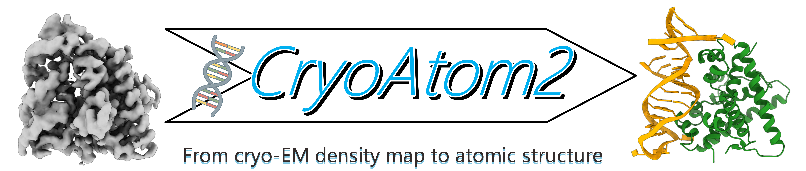
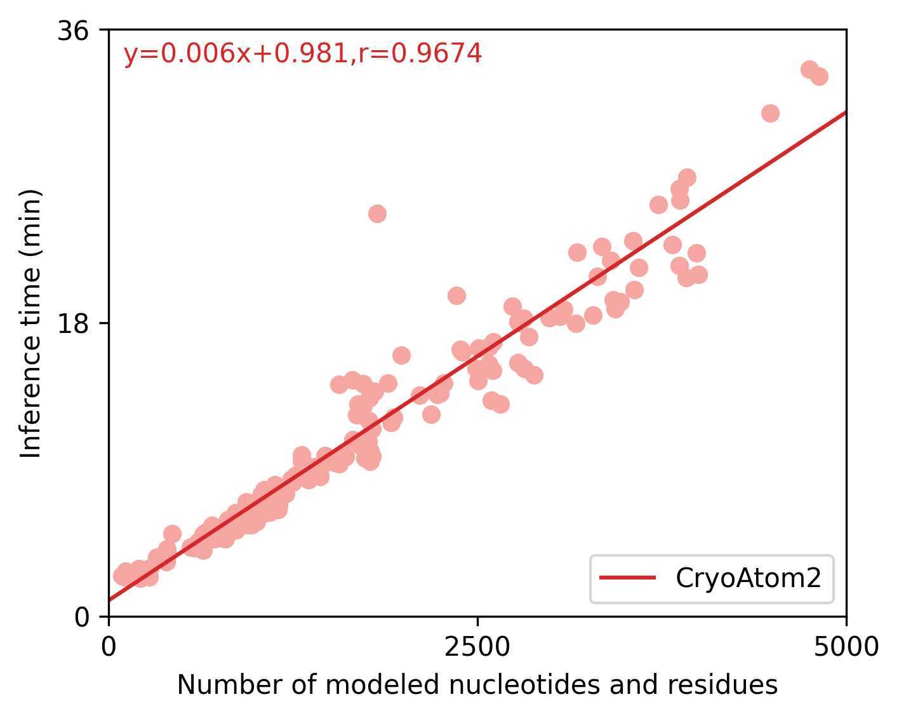

# CryoAtom2

<p align="left">
  <a>
    
    
    
    
  </a>
</p>

## Overview
CryoAtom2 is a software tool that automatically constructs all-atom models of proteins, nucleic acids, or their complexes from cryo-EM density maps and sequence information. The post-processing program for the final atomic model is modified from [ModelAngelo](https://github.com/3dem/model-angelo).

<div align=center></div>

For more details on CryoAtom2, please refer to the manuscript.

## Hardware requirements
CryoAtom2 requires at least 4GB of disk space for its own weight files plus the weight files of the ESM and RNA-FM language model. It also requires at least 14GB of GPU memory.

## Installation

<details>
<summary>Install CryoAtom2</summary>
<br>

**Step 1: Install Conda**

It requires to use conda to manage the Python dependencies, which can be installed following https://docs.conda.io/projects/conda/en/latest/user-guide/install/index.html#regular-installation.

**Step 2: Clone this repository**

Now, you need to clone this Github repository with
```
git clone https://github.com/YangLab-SDU/CryoAtom.git
```

**Step 3: Install CryoAtom2**

Navigate to the CryoAtom2 installation directory and run the installation script:

```
cd CryoAtom
source install.sh
```

**Step 4: Compile the Mean-Shift Algorithm (Optional)**

If you encounter an error `Segmentation fault (core dumped)` when running Stage 1 of CryoAtom2, please execute this step; otherwise, you can skip it. This step recompiles the mean-shift algorithm to ensure compatibility across different systems. To guarantee successful compilation, please make sure that your `g++` version is at least `4.8.5`, and then run the following commands:

```
cd CryoAtom
source compile.sh
```

Once the installation script has finished running, you will have an CryoAtom2 execution environment. Finally, you can run the command

```
cryoatom build -h
```

to check if the installation was successful.
<br>
</details>   
    
## Usage

First, use the command
```
cryoatom build -h
```
to check some basic parameters of CryoAtom2. Additionally, since the first run requires downloading 2GB ESM and 1GB RNA-FM language model weight files, the waiting time is relatively long. However, this issue does not occur in subsequent runs. Below are a few simple examples to illustrate how to use CryoAtom2.

<details>
<summary>Atomic modeling with sequence input</summary>
<br>

**Basic Arguments**

Let's say the map's name is `map.mrc` and the protein sequence file is `protein.fasta`. To build your model in a directory named `output`, you run:
```
cryoatom build -v map.mrc -ps protein.fasta -o output
```
If you would like to build nucleotides as well, you need to provide the RNA and DNA portions of your sequences in different files like so
```
cryoatom build -v map.mrc -ps protein.fasta -rs rna.fasta -ds dna.fasta -o output
```
If you only have RNA or DNA, you can drop the other input.

**Example Run**

First, prepare the density map `emd_33198.map` and the corresponding FASTA files:
```
wget https://yanglab.qd.sdu.edu.cn/CryoAtom/download/7xht.zip --no-check-certificate
unzip 7xht.zip
```
Then, run CryoAtom:
```
conda activate CryoAtom2
cryoatom build -v emd_33198.map -ps protein.fasta -rs rna.fasta -ds dna.fasta -o 7xht
```
</details> 


<details>
<summary>Protein-nucleic acid identification without sequence input</summary>
<br>

**Basic Arguments**

You can directly model the density map without any sequence, in which case CryoAtom2 will automatically assign the most likely type to each residue based on the density map. This is also the simplest command to run CryoAtom2.
```
cryoatom build -v map.mrc -o output
```
If you know the species corresponding to the density map, you can download the appropriate sequence database and use CryoAtom2 for sequence identification. Assuming you have a protein sequence database named `prot_database.fasta` and a nucleic acid sequence database named `na_database.fasta`, make sure that the databases you provide cover all the sequences present in your density map. Then run:
```
cryoatom build -v map.mrc -o output -pf prot_database.fasta -nf na_database.fasta
```
If you only want to identify proteins or nucleic acids, you can omit the corresponding parameter `-nf` or `-pf`. By running the command above, you can identify the sequences in the density map against the provided sequence databases. CryoAtom2 will return the identified results along with the corresponding sequences. Finally, it is recommended to use the identified sequences as input to CryoAtom2 for subsequent modeling.

**Example Run**

Here we present an example of performing accurate protein and nucleic acid sequence identification for a density map by incorporating species information. First, prepare the density map `emd_19830.map`, along with the human protein and nucleic acid sequence databases:
```
wget https://yanglab.qd.sdu.edu.cn/CryoAtom/download/9enb.zip --no-check-certificate
unzip 9enb.zip
```
Then use CryoAtom2 to identify the protein and nucleic acid sequences:
```
conda activate CryoAtom2
cryoatom build -v emd_19830.map -pf Homo_sapiens_prot.fasta -nf Homo_sapiens_rna.fna -o 9enb_noseq
```
Finally, use the identified sequences as input for iterative modeling.
```
cryoatom build -v emd_19830.map -ps ./9enb_noseq/9enb_noseq_prot.fasta -rs ./9enb_noseq/9enb_noseq_na.fasta -o 9enb
```
</details> 

<details>
<summary>Local modeling and identification from density maps</summary>
<br>

If you only want to model a specific local region of the density map, please provide a mask map `mask.mrc` and pass it as input using the `-m` parameter. A simplified command is shown below:
```
cryoatom build -v map.mrc -m mask.mrc -o output
```
If you have the backbone atoms of a protein or nucleic acid chain (at least the protein C<span>&alpha;</span> atoms or the nucleic acid P atoms are required), named `backbone.cif`, you can perform sequence identification for this chain:
```
cryoatom build -v map.mrc -r backbone.cif -o output -pf prot_database.fasta -nf na_database.fasta
```
If CryoAtom2 de novo modeling does not accurately build the backbone of your target protein or nucleic acid (or produces broken chains), manually building a short continuous backbone segment and running the command above to assist CryoAtom2 with sequence identification can be very helpful.

</details>

<details>
<summary>Specifying a GPU device or running multi-GPU Inference</summary>
<br>

You can run CryoAtom2 on specific GPU devices by specifying the `-d` parameter. For example, to run it on GPU with ID 0:
```
cryoatom build -v map.mrc -o output -d 0
```
If you want to run on the first three GPUs on your computer, you can use the following command:
```
cryoatom build -v map.mrc -o output -d 0,1,2
```
</details> 

## FAQs

<details>
<summary><strong>1. How to update CryoAtom2?</strong></summary>
<br>

**Option 1: Uninstall CryoAtom and reinstall**

Just delete the cloned repository directory from GitHub and uninstall the CryoAtom runtime environment using the following command:
```
conda remove -n CryoAtom2 --all
```
Then simply follow the installation process to install it again.

</details>

<details>
<summary><strong>2. Do I need to repeat the sequence of a polymer multiple times in the FASTA file?</strong></summary>
<br>

No, you should only repeat each sequence once. If there are multiple copies within the sequence, they usually need to be removed; otherwise, it may cause issues with the sequence assignment in the final model.
</details>

<details>
<summary><strong>3. How to run CryoAtom2 if I do not know the amino acid sequences?</strong></summary>
<br>

Here is a specific example to demonstrate how CryoAtom can identify the density map EMD-26626 from homo sapiens organism under the premise of unknown sequences.
First, you need the density map and the human protein sequence database:
```
wget https://ftp.ebi.ac.uk/pub/databases/emdb/structures/EMD-26626/map/emd_26626.map.gz
wget https://ftp.uniprot.org/pub/databases/uniprot/current_release/knowledgebase/reference_proteomes/Eukaryota/UP000005640/UP000005640_9606.fasta.gz
gzip -d emd_26626.map.gz
gzip -d UP000005640_9606.fasta.gz
```
If you don't know the organism information of the density map, you can also download the whole UniProt database as an alternative. Now we can identify the proteins in the density map:
```
conda activate CryoAtom2
cryoatom build -v emd_26626.map -pf UP000005640_9606.fasta -o search
```
After the run is complete, you will get `search_prot.fasta` as the initial sequence set and `new_hits_prot.xlsx` as the search results. You can modify `search_prot.fasta` according to your understanding or leave it unchanged. Finally, execute the following command:
```
cryoatom build -ps ./search/search_prot.fasta -v emd_26626.map -pf UP000005640_9606.fasta -o out
```
If no new sequences are found at this point, terminate and use `out.cif` as the final model. Otherwise, run the following command again:
```
cryoatom build -ps ./out/out_prot.fasta -v emd_26626.map -pf UP000005640_9606.fasta -o out
```
Repeat the above command until the model no longer generates new sequences.
</details>

<details>
<summary><strong>4. What do the parameters in the "config.json" file of CryoAtom2 mean?</strong></summary>
<br>

The parameters in the `config.json` file of CryoAtom are divided into three parts: `RUNet_args`, `CryoNet_args` and `HMM_search` corresponding to three steps. Below is a detailed explanation of these parameters.

RUNet performs the process of predicting C<span>&alpha;</span> atoms or P atoms. `batch_size` refers to the number of boxes processed by the network at one time. `stride` indicates the step size for sliding the box. `windows_size` refers to the side length of the cropped box. `threshold` is the filtering threshold for the predicted probability of atoms (it represents the probability value predicted by the network, ranging from 0 to 1; a lower value forces the network to output more residues).

CryoNet performs the process of constructing the all-atom model. `num_rounds` represents the number of rounds CryoNet is executed. `repeat_per_residue` refers to the minimum number of times each residue is processed by CryoNet in one round. `crop_length` refers to the number of residues processed in one batch by CryoNet. A larger value trades higher memory usage for faster speed. `raw_filter` indicates whether to filter the `raw.cif` based on the confidence score. `filter_threshold` is the filtering threshold for the confidence score (insufficient chains are trimmed). `mask_threshold` refers to the threshold used to filter residues (ranging from 0 to 1). `seq_attention_batch_size` indicates the number of residues processed at one time from the FASTA file.

HMM_search performs the process of searching sequences from a sequence database. `confidence_threshold` refers to the threshold for searching chains above the confidence score (it is also the filtering threshold for models obtained without sequence input). `Evalue` refers to the Evalue filtering threshold in HMMER (the value is multiplied by 100 for models without sequence input, but does not exceed 10). `cpus` indicates the number of CPUs used for parallel processing at one time.

Finally, to make your modifications take effect, you must specify the path to `config.json` using the following command:
```
cryoatom build -v map.mrc -o out -c .../config.json
```
</details>

<details>
<summary><strong>5. How to improve if I get poor models?</strong></summary>
<br>

**Case 1**: If the result looks very bad, with many disconnected chains, take a look at the alpha helices. If these are made of short and disconnected chains, the map was probably in the wrong hand. If you flip the map and run again, you should see much better results.

**Case 2**: If there is extra density in the density map indicating proteins (or nucleic acids), but the model does not provide prediction results, please check if there are additional high-confidence proteins or nucleic acids (with bfactor values above 60) in `out_raw.cif`. If so, this indicates that the input sequence is incomplete. Please select a larger sequence database and refer to the method described in the previous question (`FAQs 3`) to search for sequences as new input for CryoAtom2.

**Case 3**: The lower the local resolution of an area, the more randomness there is in the predicted results, which may lead to poor model performance. CryoAtom2 can be run multiple times to select the best model. Another solution is to modify the `num_rounds` or `repeat_per_residue` parameters in the `CryoNet_args` section of the `config.json` file (change it to 4). These two parameters can increase the modeling time of CryoAtom2, thereby improving the modeling quality at low resolutions. The complete command is as follows:
```
cryoatom build -v map.mrc -o out -c .../config.json
```

**Case 4**: If none of the above scenarios work, consider using human-computer interaction method. Please manually construct the backbone atoms for the poorly modeled parts based on the density map (at least include the C<span>&alpha;</span> atoms for proteins or the P atoms for nucleic acids, without needing to specify the exact identities of the amino acids or nucleic acids). Then, utilize local identification functions of CryoAtom2 mentioned in the **Usage 3** section to assist in the modeling. Achieve the best model construction through manual intervention and the support of CryoAtom2.
</details>

<details>
<summary><strong>6. Will cofactors be supported in the future?</strong></summary>
<br>

Yes, we will expand CryoAtom2 in the future to support the construction of cofactors (expected to be updated in the next major version).
</details>

<details>
<summary><strong>7. How much time it takes?</strong></summary>
<br>

<div align=center></div>
This runtime will vary across different devices. The paper tested results on a single A100 GPU, and the runtime shows a linear relationship with the number of residues. Constructing 5,000 residues takes about 0.5 hours.

Since the sequence attention module in CryoNet takes up most of the time, the above time will be significantly reduced if there is no sequence input. Conversely, if the input FASTA file contains too many sequences, it may consume a significant amount of runtime.
</details>

<details>
<summary><strong>8. How to use multiple GPUs?</strong></summary>
<br>

Multi-GPU inference is supported starting from CryoAtom `v2.1.0`. Please refer to the **Usage 4** section for detailed instructions.
</details>

<details>
<summary><strong>9. Does CryoAtom2 pose a threat to user privacy and data security?</strong></summary>
<br>

This project is completely open-source and runs in a local environment, with all operations under the user's control. Therefore, CryoAtom2 ensures privacy and data security.
</details>

## Update history

<details>
<summary>v2.1.0</summary>
<br>

- Fixed an bug where `hmm_search` could occasionally return empty identification results.
- CryoAtom now supports multi-GPU inference.
</details>

<details>
<summary>v2.0.0</summary>
<br>

- Additional support for nucleic acid modeling and identification.
- Enhanced protein modeling with over 10% absolute increase in model completeness compared with version 1.0.0.
</details>

<details>
<summary>v1.0.0</summary>
<br>

- CryFold has been renamed to CryoAtom, with support for protein modeling and identification.
</details>

## Citation
<span id="citation"></span>
If you use CryoAtom in your research or work, please cite our publications:

- **CryoAtom**: Paper available in [Nature Structural & Molecular Biology](https://www.nature.com/articles/s41594-025-01713-3). Bibtex:
```
@article {Su2025CryoAtom,
	title = {CryoAtom improves model building for cryo-EM},
	author = {Baoquan Su, Kun Huang, Zhenling Peng, Alexey Amunts, and Jianyi Yang},
	journal = {Nature Structural & Molecular Biology},
	year = {2025},
	doi = {10.1038/s41594-025-01713-3}
}
```
